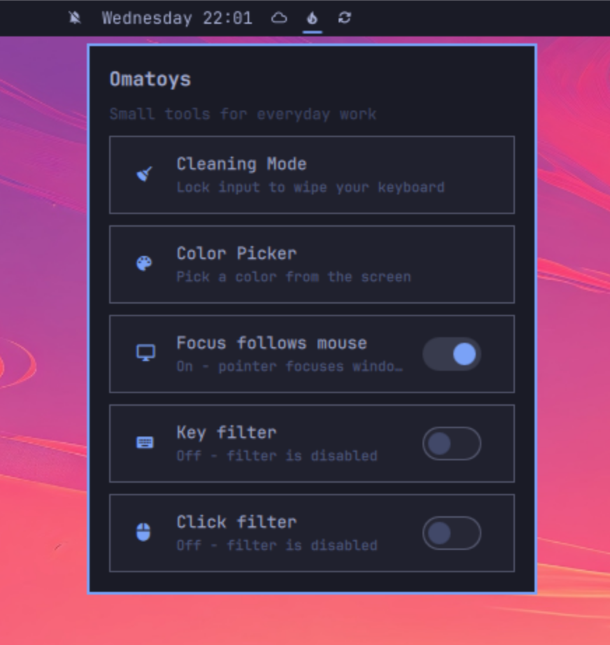
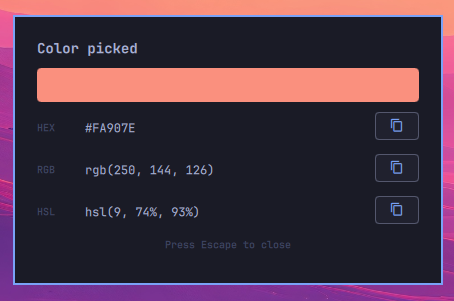

# Omatoys

Omatoys is a shareable collection of small productivity tools for Omarchy.
Tools are available from the Omatoys icon in the Omarchy top bar.

## Available tools

- **Color Picker** — A simple screen color picker: click any point to view
  its HEX, RGB, and HSL values, then copy any value with one click.
- **Cleaning Mode** — Captures keyboard and pointer input while you clean
  your keyboard. Every connected monitor is covered. Press Escape five times
  to exit.
- **Key Filter** — Filters accidental duplicate keyboard presses caused by a
  worn keyboard. It is off by default and uses a 10 ms debounce window.
- **Click Filter** — Filters rapid repeated left, right, and middle mouse
  clicks. It is off by default and uses a 25 ms debounce window. Touchpads,
  touchscreens, and graphics tablets are deliberately left alone.
- **Focus Follows Mouse** — Controls Hyprland's behavior of focusing a window
  when the pointer moves over it. It is on by default.

## Showcase

Omatoys keeps small, focused tools one click away from the Omarchy top bar:



The Color Picker makes it easy to sample a color from anywhere on screen.
Click a point, then copy the HEX, RGB, or HSL value you need.



Key Filter and Click Filter can be enabled independently. Enabling a filter
starts its systemd service immediately and enables it for future boots;
disabling it stops the service and removes its boot-time enablement. If a
service is enabled but not running, the menu says so instead of reporting it
as on, and a failed action shows its error at the bottom of the menu.

Both filters keep watching for input devices while they run, so a keyboard or
mouse plugged in later is filtered too, and unplugging one does not stop the
service.

## Installation

Install the published plugin through Omarchy:

```bash
omarchy plugin add https://github.com/eithe/omatoys.git --enable
```

The plugin is identified as `io.github.eithe.omatoys` and appears in the
configured bar layout. Key Filter and Click Filter install `python-evdev`,
their shared helper, and their systemd service only when first enabled.

For development from a local checkout, clone the project and run the
installer:

```bash
git clone https://github.com/eithe/omatoys.git omatoys
cd omatoys
./install.sh
```

The development installer:

- Copies the Omatoys shell plugin under
  `~/.config/omarchy/plugins/io.github.eithe.omatoys/`, excluding VCS metadata
  and the development scripts.
- Installs `python-evdev` with the Arch package manager.
- Stages the privileged helper into `/usr/local/lib/omatoys/`.
- Reloads the Omarchy shell.

Nothing is elevated until you turn a filter on. Cleaning Mode, Focus Follows
Mouse, and the bar widget itself never ask for a password.

The first time you enable Key Filter or Click Filter from the menu, the shared
helper and that filter's systemd service are installed through a graphical
`pkexec` prompt, started immediately, and enabled for future boots. Disabling a
filter stops the service and removes its boot-time enablement, but leaves the
installed files in place for the next enable.

### How the privileged part is kept contained

The helper has to run as root, because it reads `/dev/input/event*` and writes
`/dev/uinput`. Two things limit what that means in practice.

**The plugin directory is executed as root exactly once.** `omarchy plugin add`
clones this repository into `~/.config/omarchy/plugins/`, which your user
account can write to. The first enable runs the installer from there, and that
run copies the installer, the helper, and both unit files into
`/usr/local/lib/omatoys/`, which is owned by root. From then on the bar widget
only ever elevates the root-owned copy, so the writable plugin directory is
never run as root again.

Re-staging after a plugin update is deliberate and never automatic:

```bash
sudo ~/.config/omarchy/plugins/io.github.eithe.omatoys/tools/install-filter-service.sh --stage
```

This is on purpose. Re-staging automatically whenever the plugin copy differed
from the staged one would defeat the arrangement, because "this file changed"
is exactly what someone who had rewritten it would produce. The cost is that
helper improvements from a plugin update do not apply until you re-stage;
`./install.sh` does it for you on the development path.

**The service is sandboxed.** Both units drop every capability except
`CAP_DAC_OVERRIDE`, run with no network (`PrivateNetwork`, `IPAddressDeny`),
a read-only system (`ProtectSystem=strict`), no access to your home
(`ProtectHome`), `NoNewPrivileges`, a syscall filter, and a device allowlist
limited to `char-input` and `/dev/uinput`. If the helper were ever replaced,
what it gets is a confined process rather than a usable root shell.

What this does **not** cover: a machine already compromised before your first
ever filter enable. Closing that would need signed releases with trust on first
use, which is more machinery than this plugin warrants.

If a filter fails to start after a system upgrade, the sandbox is the first
place to look — `systemctl status omatoys-key-filter.service` and
`journalctl -u omatoys-key-filter.service` will name the directive.

### Tuning the debounce windows

Both services read `OMATOYS_FILTER_WINDOW_MS`, so a window can be changed
without editing the source:

```bash
sudo systemctl edit omatoys-key-filter.service
```

```ini
[Service]
Environment=OMATOYS_FILTER_WINDOW_MS=20
```

Then `sudo systemctl restart omatoys-key-filter.service`. An unset, invalid, or
negative value falls back to the built-in default.

## Uninstalling

To remove the project-managed installation, run:

```bash
./uninstall.sh
```

The uninstall script removes the Omatoys plugin directory, removes its bar
entry from `~/.config/omarchy/shell.json` (writing a `.omatoys-backup` copy
first and swapping the file atomically), disables and stops both filter
services, removes their systemd units and the root-owned staging directory,
reloads systemd, and reloads the Omarchy shell. It intentionally leaves the
shared `python-evdev` package installed because other applications may use it.

The equivalent manual cleanup is:

```bash
pkexec systemctl disable --now omatoys-key-filter.service
pkexec systemctl disable --now omatoys-click-filter.service
pkexec rm -f \
  /etc/systemd/system/omatoys-key-filter.service \
  /etc/systemd/system/omatoys-click-filter.service
pkexec rm -rf /usr/local/lib/omatoys
pkexec systemctl daemon-reload
rm -rf ~/.config/omarchy/plugins/io.github.eithe.omatoys
```

## Development

The plugin entry point lives in the repository root and individual tools live
under `tools/`:

| Path | Purpose |
| --- | --- |
| `BarWidget.qml` | Bar entry point and the tools menu |
| `tools/cleaning-mode/` | The full-screen input-blocking overlay |
| `tools/focus-follows-mouse/` | Hyprland `follow_mouse` toggle |
| `tools/input-filter/` | Shared key and click debounce helper, plus its units |
| `tools/install-filter-service.sh` | Root-side installer, invoked via `pkexec` |
| `tools/lib/omatoys-common.sh` | Helpers shared by `install.sh` and `uninstall.sh` |
| `tests/` | Unit tests for the filter, and the installer behaviour test |

Install into the current user's Omarchy configuration with `./install.sh`.
Rerun the installer after source changes, then use a plugin rescan or shell
restart. Rerunning it also re-stages the privileged helper.

Both filters are the same program, `tools/input-filter/omatoys-input-filter.py`,
selected by a `key` or `click` argument in the unit file. It is staged once as
`/usr/local/lib/omatoys/omatoys-input-filter`.

The plugin id lives in `manifest.json` and is read from there by the install
and uninstall scripts. `BarWidget.qml` repeats it as `moduleName`; CI fails if
the two drift apart.

### Checks

CI runs shellcheck over the shell scripts, `ruff` over the Python, both test
suites, and a manifest consistency check. To run the same checks locally:

```bash
shellcheck install.sh uninstall.sh tools/install-filter-service.sh \
  tools/focus-follows-mouse/toggle.sh tools/lib/omatoys-common.sh \
  tests/test-install-filter-service.sh
ruff check .
python -m unittest discover -s tests
bash tests/test-install-filter-service.sh
python3 .github/scripts/check-manifest.py
```

The Python tests stub out device access, so they run unprivileged, but they do
import `evdev` for its event code constants.

`tests/test-install-filter-service.sh` runs the privileged installer without
root by redirecting the absolute paths it touches into a temporary directory
and stubbing `pacman` and `systemctl`. It asserts the property the staging
design exists for: once the helper is staged, a later run must ignore a
tampered copy in the plugin directory.

`check-manifest.py` asserts that the sandboxing directives are present in both
unit files, so the confinement cannot be weakened without CI noticing.
